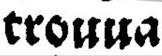
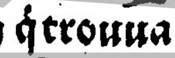
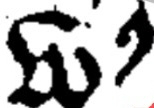

# Normes de transcription

 

## s long: "ʃ"

 

La transcription de cette image est "ʃe"

 

## d minuscule : "ẟ" ou "ꝺ"

On utilise deux versions du "d" en fonction de la manière dont il est écrit.

La transcription de cette image est "et ẟit."

  

La transcription de cette image est "ꝺe la"

 

## e avec tilde : ẽ

On transcrit les tildes. 

La transcription de cette image est "ẽferra"

 

## macrons : 

Nous faisons le choix de distinguer les tildes et les macrons, contrairement à ce que préconise Ariane Pinche. Nous considérons que le tilde et le macron ont des sens différents, et qu'il faut conserver cette distinction graphique. Ainsi, la transcription de ce caractère est "qͥ".

## v en debut de mot : ƃ

La transcription de cette image est "que ƃous"

 

## majuscules

On n'utilise pas de caractères particulieres pour les majuscule

La transcription de cette image est "Sire"

## Distinction u et v

On ne distingue pas u et v. On laisse u.

La transcription de cette image est "trouua"

## Signe vertical qͥ

On garde les signes verticaux

La transcription de cette image est "qͥ trouua"

## r rotunda : "ꝛ"

On distingue les "ꝛ" (r rotunda) et "r". 

## abréviation « us »  : "ɂ"

## espaces « »  :

Les textes médiévaux utilisent les espaces de façon arbitraire, laissant le lecteur déchiffrer le texte à l’aide de sa connaissance sémantique. Ariane Pinche préconise de séparer les mots sémantiques. Nous suivons ses conseils. 

