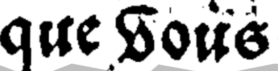

# Normes de transcription :

 

# Signes fonctionnels : 

## Pieds de mouche : 

Les pieds de mouche, à l'image de cet exemple, sont rendus par le caractère suivant : "¶".

# Lettres : principes généraux :

## s long: "ʃ" :

 

La transcription de cette image est "ʃe"

 

## d minuscule : "ẟ" ou "ꝺ" :

On utilise deux versions du "d" en fonction de la manière dont il est écrit.

La transcription de ces caractères est "et ẟit."

  

La transcription de ces caractères est "ꝺe la"

 

## V en debut de mot : ƃ :

La transcription de ces caractères est "que ƃous"

 

## Distinction entre u et v :

On ne distingue pas u et v : on laisse u.

La transcription de ces caractères est "trouua"

## R rotunda : "ꝛ" :

On distingue les "ꝛ" (r rotunda) et "r". 

## Lettres : lettrines et majuscules :

On n'utilise pas de caractères particulieres pour les lettrines, qui sont transcrites comme des majuscules standard.

La transcription de ces caractères est "Sire"

# Abréviations : 

# « us »  : "ɂ"

## e avec tilde : ẽ :

On transcrit les tildes. 

La transcription de cette image est "ẽferra"

 

## Signe vertical qͥ :

On garde les signes verticaux

La transcription de cette image est "qͥ trouua"

# La segmentation des mots : 

## Les espaces « »  :

Les textes médiévaux utilisent les espaces de façon arbitraire, laissant le lecteur déchiffrer le texte à l’aide de sa connaissance sémantique. Ariane Pinche préconise de séparer les mots sémantiques. Nous suivons ses conseils. 

