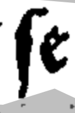
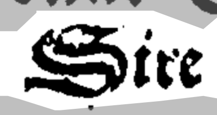

# Normes de transcription

 

## s long: "ʃ"

 

La transcription de cette image est "ʃe"

 

## d minuscule : "ẟ" ou "ꝺ"

On utilise deux versions du "d" en fonction de la manière dont il est écrit.

La transcription de cette image est "et ẟit."

 

## e avec tilde : ẽ

On transcrit les tildes aussi. 

La transcription de cette image est "ẽferra"

 

## v en debut de mot : ƃ

La transcription de cette image est "que ƃous"

 

## majuscules

On n'utilise pas de caractères particulieres pour les majuscule

La transcription de cette image est "Sire"

## Distinction u et v

On ne distingue pas u et v. On laisse u.

La transcription de cette image est "trouua"

## Signe vertical qͥ

On garde les signes verticaux

La transcription de cette image est "qͥ trouua"

## r rotunda : "ꝛ"

On distingue les "ꝛ" (r rotunda) et "r". 

## abréviation « us »  : "ɂ"

